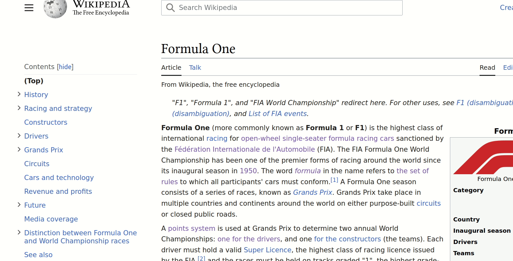

# backlinks-search (b-search)

Ever find yourself wanting to know which webpages link to the website you are currently reading? This simple add-on is for you! 

Heavily adapted from [side-view](https://github.com/mozilla/side-view), this add-on queries backlinks of the current url using Google search and displays in the sidebar.

## Installing

Use `npm install`, then `npm start`.

## Installing manually

Check out the repository. Go to `about:debugging` in Firefox, and select **Load Temporary Add-on**. Select a file in the `addon/` directory.

Or: install [`web-ext`](https://github.com/mozilla/web-ext) (like `npm i -g web-ext`) and run `web-ext run -s addon/ --browser-console -f nightly`

## Using

This adds a context menu item: **Open in sidebar** or **Open link in sidebar**. Select that, and the sidebar will be opened with a mobile view of the page.

## Credits

[Anthony_f](https://addons.mozilla.org/en-US/firefox/user/Anthony_f/)'s [Sidebar for Google Search](https://addons.mozilla.org/en-US/firefox/addon/sidebar-for-google-search/) inspired this add-on's approach.

